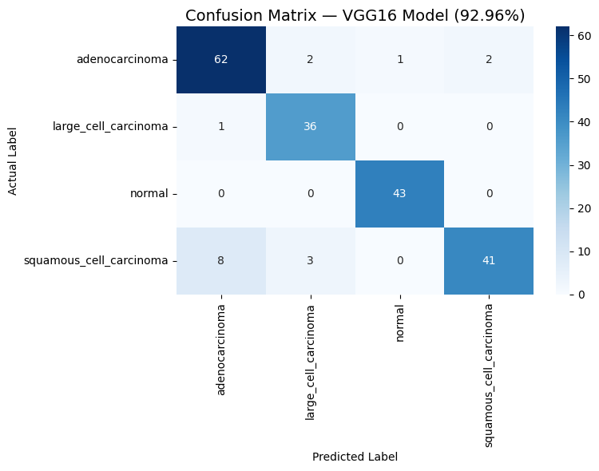
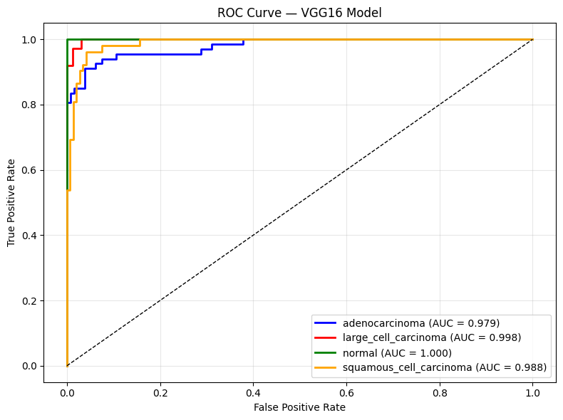
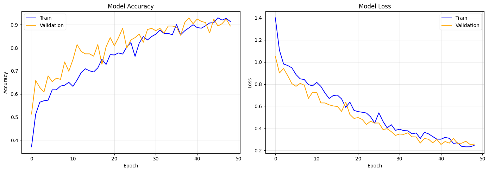
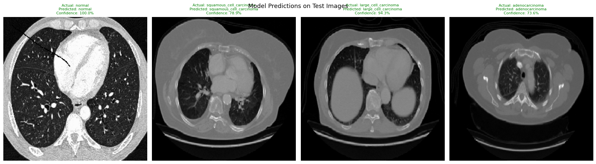

# 🫁 Lung Cancer Detection Using Deep Learning

A Final Year Project that uses **VGG16 Transfer Learning** to automatically
detect lung cancer from CT scan images with **92.96% accuracy**.

## 🎯 Project Overview

Lung cancer is one of the leading causes of cancer-related deaths worldwide.
Early detection significantly increases survival rates. This project builds
an AI-powered system that automatically analyzes chest CT scan images and
classifies them into 4 categories.

---

## 🔬 Classes Detected

| Class | Description |
|-------|-------------|
| Adenocarcinoma | Most common type of lung cancer |
| Large Cell Carcinoma | Fast-growing cancer type |
| Squamous Cell Carcinoma | Cancer in lung's airways |
| Normal | Healthy lung — no cancer detected |

---

## 📊 Model Performance

| Metric | Score |
|--------|-------|
| **Accuracy** | **92.96%** |
| **Precision** | **92.05%** |
| **Recall** | **92.17%** |
| **F1-Score** | **91.83%** |
| **AUC (Normal)** | **1.000** |
| **AUC (Large Cell)** | **0.998** |
| **AUC (Squamous)** | **0.988** |
| **AUC (Adenocarcinoma)** | **0.979** |

---

## 🏗️ System Architecture
CT Scan Image
↓
Image Preprocessing (resize 224x224, normalize)
↓
Data Augmentation (rotation, flip, zoom)
↓
VGG16 Transfer Learning Model
↓
Classification (4 classes)
↓
Result + Confidence Score
---

## 🛠️ Technologies Used

- **Python 3.10**
- **TensorFlow / Keras** — Deep Learning
- **VGG16** — Pretrained Transfer Learning Model
- **OpenCV** — Image Processing
- **Scikit-learn** — Evaluation Metrics
- **Streamlit** — Web Application
- **Matplotlib / Seaborn** — Visualization
- **Google Colab** — GPU Training

---

## 📁 Project Structure
lung-cancer-detection/
├── FinalProject.ipynb       ← Complete training notebook
├── app.py                   ← Streamlit prediction app
├── confusion_matrix.png     ← Model evaluation
├── roc_curve.png            ← ROC AUC curves
├── training_history.png     ← Accuracy & loss graphs
├── test_predictions.png     ← Sample predictions
└── README.md
---

## 🚀 How to Run the App

**Step 1 — Clone the repo:**
bash
git clone https://github.com/Anurima-Das/lung-cancer-detection.git
cd lung-cancer-detection

**Step 2 — Install dependencies:**
bash
pip install tensorflow streamlit pillow numpy opencv-python

**Step 3 — Download the model:**

Download `final_model.h5` from our shared Google Drive and place it
in the project folder.

**Step 4 — Run the app:**
bash
streamlit run app.py

**Step 5 — Open browser:**
http://localhost:8501/
Upload any chest CT scan image → get instant prediction!

---

## 📈 Results

### Confusion Matrix

### ROC Curve

### Training History

### Sample Predictions

---

## 👥 Team Members

| Member | Role |
|--------|------|
| Anurima Das | Deep Learning & App Development |
| Anushka De  | ML Models & Evaluation |
| Siddheeka Ray | Data & Preprocessing |
| Ankit Kumar | Literature Review & Presentation |
| Avinaw Shah | Report Writing |

---

## 📚 Dataset

- **Source:** Kaggle — Chest CT-Scan Images Dataset
- **Total Images:** 1000
- **Classes:** 4
- **Split:** 80% Train / 20% Validation

---

## 🔮 Future Scope

- Integration with hospital information systems
- Real-time diagnosis using IoMT devices
- Federated learning for secure medical data sharing
- Explainable AI (Grad-CAM) for tumor localization
- Mobile application for remote diagnosis

---

## ⚠️ Disclaimer

This tool is for **research and educational purposes only**.
Always consult a qualified medical professional for diagnosis.

---

## 🏫 Institution

**Final Year Project — B.Tech Computer Science(Cybersecurity including IOT and Blockchain Technology)**
*2026–2027*
